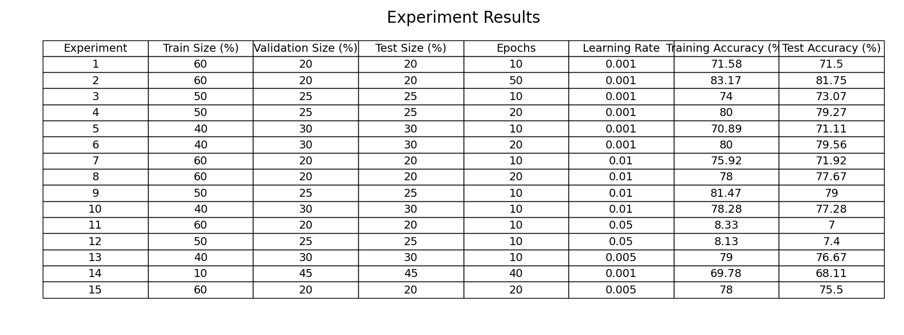
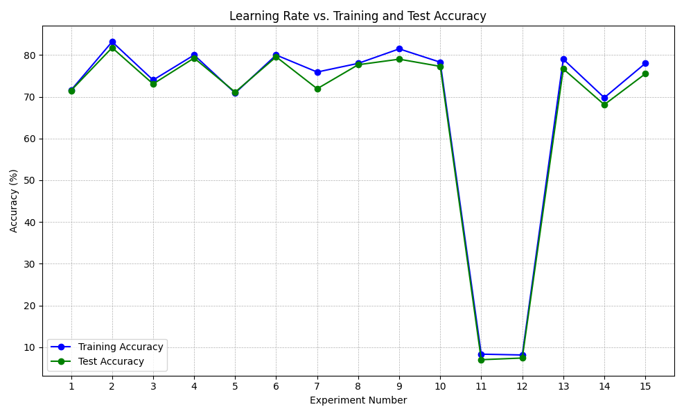

# Optimizing Deep Learning for Classification of Coronavirus Lineages

---

## Introduction and Motivation

As the global scientific community grapples with the challenges posed by the novel coronavirus's diverse lineages, precise classification of these lineages becomes paramount. It is essential for decoding the virus's evolution, transmission patterns, and potential virulence. Given the multifaceted nature of this task, deep learning, renowned for its adeptness in handling complex data, emerges as a potent tool. The success of such an approach hinges on the hyperparameters and the choice of the neural network.

---

## Method and Design

### Network Selection

Our decision to employ a specific deep learning network was grounded in multiple factors:

- **Superior Classification Efficiency**: This network stood out in its feature extraction prowess, a crucial capability for intricate tasks like lineage identification.
- **Scalability with Data Augmentation**: The continual emergence of new virus variants necessitates a network's compatibility with augmented data. Our selection excelled in this domain.
- **Overfitting Mitigation**: The architecture inherently minimizes overfitting risks, ensuring broader applicability and reliability.
- **Comparison to Alternatives**: Beyond just performance metrics, this network's modular design facilitates easier updates and modifications. This adaptability, often absent in many counterparts, sets it apart.

### Dataset Composition and Division

Our dataset, comprising 6000 meticulously curated samples (500 for each of the 12 coronavirus lineages), was subjected to different divisions. Ratios like 60-20-20 and 50-25-25 were tested for training, validation, and testing sets to ascertain the optimal data distribution.

---

## Evaluation Methodology

1. **Data Sets**: Deliberate dataset divisions were crafted to investigate the influence of different training data volumes.
2. **Training Process**:
   - **Initialization**: Leveraging the He-Initialization technique ensured a stable gradient landscape.
   - **Optimization Algorithm**: The Adam optimizer, celebrated for its adaptive learning rate prowess, was our choice.
   - **Loss Function**: The cross-entropy loss, apt for classification tasks, was the cornerstone of our training regimen.
3. **Evaluation Metrics**: Model effectiveness was gauged primarily through training and test accuracies.

---

## Results

1. **Accuracy**:
   - Peak Training Accuracy: 83.17% (Experiment 2)
   - Peak Test Accuracy: 81.75% (Experiment 2)
   - A significant performance degradation was evident with a 0.05 learning rate, highlighting the intricacies of hyperparameter tuning.

## Experiment Results

---

## Conclusions

The following key insights emerged:

1. **Learning Rate's Critical Role**: An optimal learning rate is non-negotiable for model stability and convergence.
2. **Influence of Dataset Composition**: While larger training datasets bolstered performance, there was a threshold beyond which benefits plateaued.
3. **Strategic Network Choice**: The choice of the neural network is pivotal. Our selection, striking a balance between efficiency and adaptability, outperformed several other contenders.

As the virus's evolutionary journey unfolds, the ability to swiftly adapt and refine models will be of essence. Our endeavors lay a foundation for this ongoing battle, offering insights and strategies for future research.

