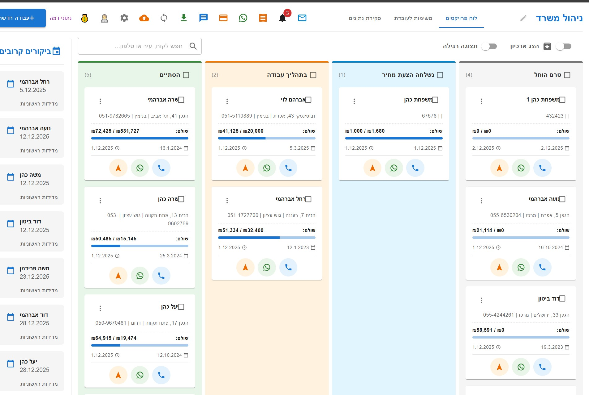
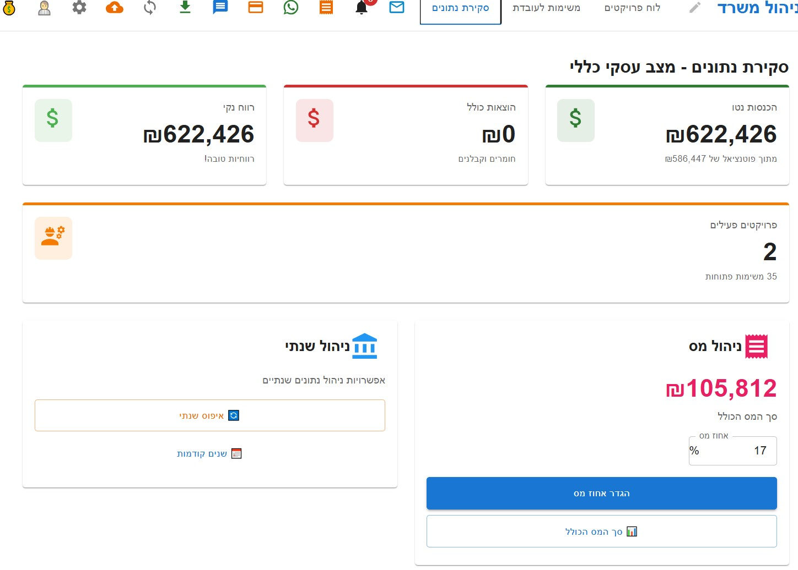
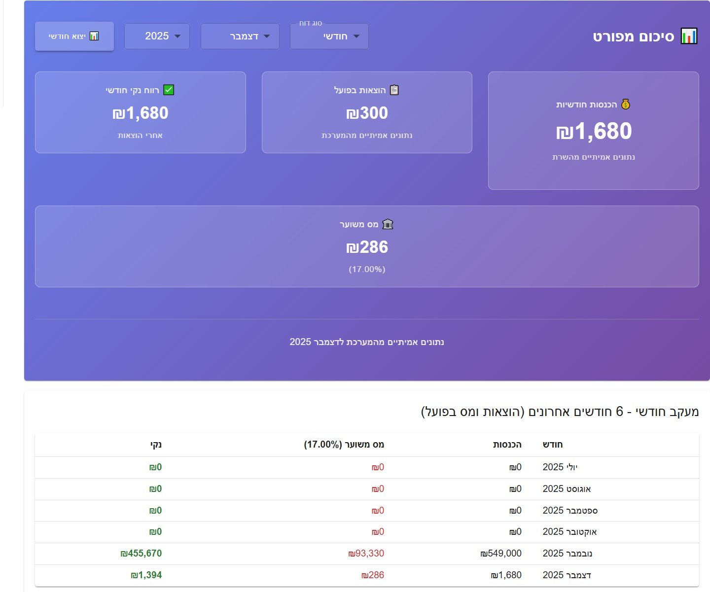

# מערכת CRM לחברת בנייה

מערכת ניהול לקוחות ופרויקטים מקיפה לחברות בנייה, עם דשבורד מתקדם לניהול עסקי.

## תכונות עיקריות

### 📊 דשבורד עסקי מתקדם
- **סקירת נתונים בזמן אמת** - סטטיסטיקות עדכניות על הכנסות, הוצאות ורווח
- **ניהול מס חכם** - חישוב אוטומטי של מס עם אפשרות להגדרת אחוזים
- **דוחות חודשיים ושנתיים** - יצוא CSV מפורט לכל תקופה
- **מעקב חודשי** - טבלה של 6 חודשים אחרונים עם נתונים אמיתיים

### 🏗️ ניהול פרויקטים
- **כרטיסי פרויקטים** - ממשק נוח לצפייה וניהול פרויקטים
- **מעקב סטטוס** - In-Progress, Completed, Potential
- **ניהול תשלומים** - מעקב תשלומים לכל פרויקט
- **ניהול הוצאות** - תיעוד הוצאות עבור כל פרויקט

### 📋 ניהול משימות
- **רשימת משימות** - יצירה וניהול משימות לכל פרויקט
- **מעקב התקדמות** - סטטוסים של משימות
- **הערות ותיעוד** - תיעוד מפורט לכל משימה

### 💰 ניהול כספי
- **מעקב תשלומים** - רישום ומעקב תשלומים מלקוחות
- **ניהול הוצאות עסקיות** - תיעוד כל ההוצאות
- **חישוב רווחיות** - חישוב אוטומטי של רווח נקי

### 📱 תמיכה במובייל
- **ממשק מותאם מובייל** - עיצוב רספונסיבי מלא
- **אפליקציה ייעודית** - רכיב MobileApp נפרד
- **ניווט נוח** - ממשק מותאם למסכים קטנים

## 📸 צילומי מסך

### דשבורד ניהול לקוחות ופרויקטים
הצגת כרטיסי הלקוחות והפרויקטים עם מעקב אחרי סטטוסים, תשלומים ותאריכים.



### דשבורד מתקדם - סקירת נתונים כספיים
דשבורד עם נתונים כספיים מפורטים, ניהול מס וסיכום חודשי עם גרף התקדמות.



### סקירת נתונים עסקיים כללית
מבט כולל על הביצועים העסקיים עם נתוני רווח, הוצאות והכנסות.



**תכונות מרכזיות בצילומים:**
- 🎯 **כרטיסי לקוחות** עם מעקב סטטוסים ותשלומים
- 📊 **סטטיסטיקות כספיות** בזמן אמת
- 💰 **ניהול מס חכם** עם חישובים אוטומטיים
- 📈 **גרפים ודוחות** חודשיים ושנתיים
- 🎨 **עיצוב מקצועי** עם גרדיאנטים ואנימציות

## טכנולוגיות

### Frontend
- **React 18** + **TypeScript** - ממשק משתמש מודרני
- **Material-UI (MUI)** - רכיבי עיצוב מקצועיים
- **Vite** - כלי בנייה מהיר
- **Responsive Design** - תמיכה בכל גדלי המסכים

### Backend  
- **NestJS** - פריימוורק Node.js מתקדם
- **TypeScript** - פיתוח בטוח ומהיר
- **PostgreSQL** - בסיס נתונים יציב ומהיר
- **Docker** - קונטיינרים לפריסה קלה

### אינפרסטרוקטורה
- **Docker Compose** - ניהול services מרובים
- **PostgreSQL Database** - אחסון נתונים מהיר ויציב
- **Backup System** - גיבוי אוטומטי של הנתונים
- **REST API** - תקשורת מובנית בין Frontend ל-Backend

## התקנה והפעלה

### דרישות מערכת
- Docker & Docker Compose
- Node.js 18+ (לפיתוח)
- Git

### התקנה מהירה

1. **שכפול הפרויקט:**
```bash
git clone https://github.com/turbh11/MyProjects.git
cd crm-system
```

2. **הפעלה עם Docker:**
```bash
docker-compose up -d --build
```

3. **גישה למערכת:**
- Frontend: http://localhost
- Backend API: http://localhost:3001

### פיתוח מקומי

1. **התקנת תלויות:**
```bash
# Backend
cd backend
npm install

# Frontend  
cd ../frontend
npm install
```

2. **הפעלת מסד נתונים:**
```bash
docker-compose up -d db
```

3. **הפעלת השרתים:**
```bash
# Backend (טרמינל 1)
cd backend
npm run start:dev

# Frontend (טרמינל 2) 
cd frontend
npm run dev
```

## מבנה הפרויקט

```
crm-system/
├── frontend/               # אפליקציית React
│   ├── src/
│   │   ├── components/     # רכיבי UI
│   │   │   ├── Dashboard.tsx      # דשבורד עיקרי
│   │   │   ├── MobileApp.tsx      # אפליקציה למובייל
│   │   │   └── ...
│   │   ├── api/           # קליינט API
│   │   └── ...
├── backend/               # שרת NestJS
│   ├── src/
│   │   ├── projects/      # ניהול פרויקטים
│   │   ├── payments/      # מערכת תשלומים
│   │   ├── tasks/         # ניהול משימות
│   │   ├── expenses/      # ניהול הוצאות
│   │   ├── tax/          # מערכת מס
│   │   └── ...
├── docker-compose.yml     # הגדרות Docker
└── README.md             # התיעוד הזה
```

## תכונות מיוחדות

### דשבורד מתקדם
המערכת כוללת דשבורד עסקי מתקדם עם:
- **כרטיסי סטטיסטיקה** - הצגת נתונים עיקריים
- **ניהול מס חכם** - חישוב אוטומטי וניהול אחוזי מס
- **סיכום חודשי מפורט** - עם גרדיאנט יפה ונתונים אמיתיים
- **יצוא דוחות** - CSV חודשיים ושנתיים
- **טבלה חודשית** - מעקב אחרי 6 חודשים אחרונים

### מערכת גיבויים
- **גיבוי אוטומטי** של בסיס הנתונים
- **ייצוא קבצים** בפורמטים שונים
- **שחזור נתונים** במקרה הצורך

### אבטחה
- **הצפנת נתונים** רגישים
- **API מאובטח** עם validation
- **ניהול הרשאות** למשתמשים שונים

## API מרכזי

### פרויקטים
- `GET /projects` - קבלת כל הפרויקטים
- `POST /projects` - יצירת פרויקט חדש
- `PUT /projects/:id` - עדכון פרויקט
- `DELETE /projects/:id` - מחיקת פרויקט

### תשלומים
- `GET /payments` - קבלת כל התשלומים
- `POST /payments` - רישום תשלום חדש
- `GET /payments/export/csv` - יצוא דוח CSV

### מס וכספים
- `GET /tax/info` - קבלת מידע מס נוכחי
- `POST /tax/percentage` - עדכון אחוז מס
- `GET /monthly-data/:month/:year` - נתונים חודשיים

## תמיכה במובייל

המערכת מותאמת במלואה למובייל עם:
- **עיצוב רספונסיבי** מלא
- **רכיב MobileApp** ייעודי
- **ניווט מותאם** למסכים קטנים
- **ביצועים מותאמים** לרשתות איטיות

## פיתוח ותחזוקה

### הוספת תכונות חדשות
1. צור branch חדש: `git checkout -b feature/new-feature`
2. פתח את הקוד ב-VSCode
3. הפעל Docker containers: `docker-compose up -d`
4. בצע שינויים ובדוק
5. שלח Pull Request

### בדיקות
```bash
# Backend tests
cd backend
npm run test

# Frontend build test
cd frontend  
npm run build
```

### עדכון dependencies
```bash
# עדכון packages
npm update

# עדכון Docker images
docker-compose pull
docker-compose up -d --build
```

## רישיון

הפרויקט פרטי ושייך לבעלים של הרפוזיטורי.

---

## צרו קשר

לשאלות ותמיכה טכנית, פנו אליי דרך GitHub Issues או Email.

**נבנה עם ❤️ בישראל**